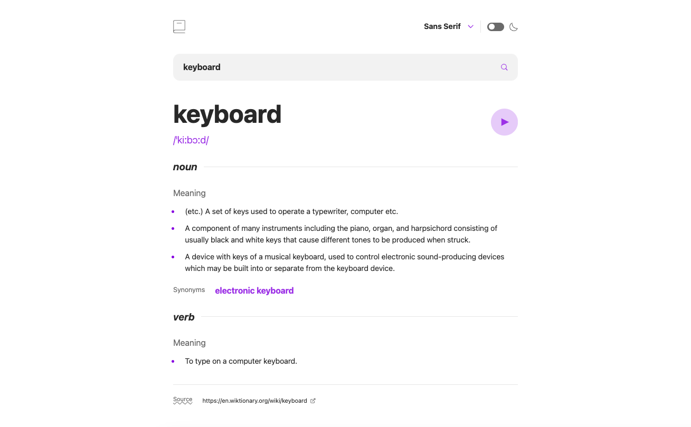

# Dictionary Web App

A dictionary web application

## Table of contents

- [Overview](#overview)
  - [Requirements](#requirements)
  - [Screenshot](#screenshot)
  - [Links](#links)
- [My process](#my-process)
  - [Built with](#built-with)
  - [What I learned](#what-i-learned)
  - [Useful resources](#useful-resources)
- [Author](#author)

## Overview

### Requirements

Users should be able to:

- Search for words using the input field
- See the Free Dictionary API's response for the searched word
- See a form validation message when trying to submit a blank form
- Play the audio file for a word when it's available
- Switch between serif, sans serif, and monospace fonts
- Switch between light and dark themes
- View the optimal layout for the interface depending on their device's screen size
- See hover and focus states for all interactive elements on the page

### Screenshot




### Links

- Solution URL: [Link](https://github.com/cjoak1028/dictionary-web-app)
- Live Site URL: [Link](https://your-live-site-url.com)

## My process

### Built with

- Mobile-first workflow
- [React](https://reactjs.org/) - JS Library
- [Tailwind](https://styled-components.com/) - CSS Framework

### What I learned

The following code is a snippet from the useFetchWord custom hook that is used to fetch word data from the Free Dictionary API:

```jsx
useEffect(() => {
  setLoading(true);
  setError(false);

  if (!word) {
    setData(null);
    setLoading(false);
    return;
  }

  async function fetchWordData(word) {
    const url = `https://api.dictionaryapi.dev/api/v2/entries/en/${word}`;
    try {
      const response = await fetch(url);

      if (!response.ok) {
        throw new Error(`Reponse status: ${response.status}`);
      }

      const data = await response.json();
      if (!ignore) {
        setData(data[0]);
      }
    } catch (error) {
      setError(true);
    } finally {
      setLoading(false);
    }
  }

  let ignore = false;
  fetchWordData(word);
  return () => {
    ignore = true;
  };
}, [word]);
```

I learned that when dealing with network responses, race conditions can occur such as when searching for a new word while a fetch is still in progress. To prevent this, I used an ignore variable that starts as false. When the word dependency changes, the cleanup function in the effect sets ignore to true, indicating that the previous request should be ignored. This way, if the fetch completes after the word has changed, the data state won't be updated with outdated data.

### Useful resources

- [Tailwind Docs](https://tailwindcss.com)
- [React Reference](https://react.dev/reference/react)

## Author

- Website - [CJ Kim](https://cjkim.dev/)
- Frontend Mentor - [@cjoak1028](https://www.frontendmentor.io/profile/cjoak1028)
- Github - [@cjoak1028](https://github.com/cjoak1028)
- Linkedin - [CJ Kim](https://www.linkedin.com/in/cj-kim-966351255/)
